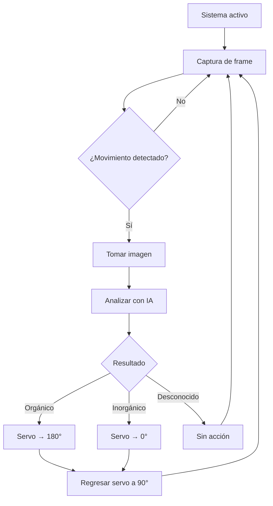
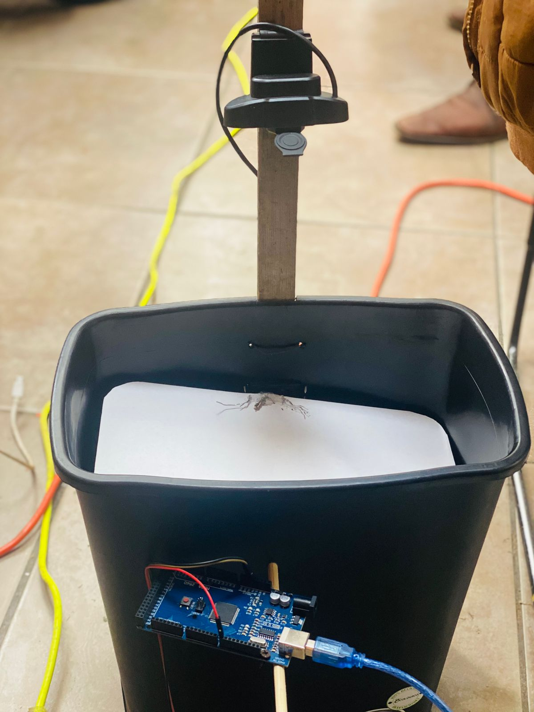

<div align="center">

# Clasificador inteligente de basura con IA

**Sistema automático de separación de residuos orgánicos e inorgánicos usando inteligencia artificial, Arduino y un modelo de IA local**

</div>

---

## Descripción del proyecto

Este proyecto implementa **varios elementos básicos**, modificados para que sean capaces de **detectar, analizar y clasificar residuos automáticamente** en:

- Orgánicos  
- Inorgánicos  

El sistema utiliza una **cámara web**, un **modelo de visión artificial ejecutado localmente** y un **servomotor controlado por Arduino** para mover físicamente una compuerta dentro del bote.

El flujo es completamente automático:
1. Se detecta movimiento (objeto presente)
2. Se captura la imagen
3. La IA analiza el tipo de residuo
4. Se mueve el servo según el resultado

---

## Características principales

- Clasificación automática de residuos  
- IA local (sin internet)  
- Comunicación entre Arduino y Python por serial  
- Control mediante servidor MCP (FastMCP)  

---

## Hardware utilizado

| Componente | Función |
|:--|:--|
| Arduino Mega 2560 | Control del servomotor |
| Servomotor | Movimiento de la compuerta del bote |
| Webcam USB | Captura de imágenes |
| Bote de basura | Estructura física del sistema |

---

## Conexiones

| Pin Arduino | Componente |
|:--|:--|
| `8` | Señal del servo |
| `5V` | Alimentación |
| `GND` | Tierra |

---

## Flujo del sistema



---

## Fotografía de la maqueta

<div align="center">
  
</div>

---

## Detección de objetos

El sistema detecta objetos utilizando diferencia de fondo:

```python
diff = cv2.absdiff(frame, fondo)
gray = cv2.cvtColor(diff, cv2.COLOR_BGR2GRAY)
_, th = cv2.threshold(gray, 25, 255, cv2.THRESH_BINARY)

return th.sum() > 3000000
```

---

## Tools

| Tool | Descripción |
|:--|:--|
| `iniciar_sistema()` | Activa el sistema completo, permitiendo la detección, análisis y clasificación automática de objetos |
| `detener_sistema()` | Detiene completamente el sistema, pausando la cámara, la IA y el movimiento del servo |
| `angulo_actual()` | Devuelve el ángulo actual del servomotor para conocer su posición |
| `vacio()` | Gira el servo a 180°, espera 10 segundos, luego gira a 0° y finalmente regresa a su posición original |

---

## Modelo implementado

El modelo **Qwen3-VL** analiza la imagen y devuelve la clasificación.

---

## Clasificación con IA

El modelo recibe la imagen y responde con:

- Organico  
- Inorganico  

---

## Prompt utilizado

```
Eres un clasificador de residuos. Analiza la imagen y responde SOLO con una palabra.

EJEMPLOS DE ORGANICO (responde: organico):
- cascara de platano, naranja, mango, limon
- fruta entera o mordida
- restos de comida, semillas, huesos

EJEMPLOS DE INORGANICO (responde: inorganico):
- botella de plastico (agua, refresco, jugo)
- botella de vidrio
- bolsa de plastico
- lata de metal
- carton o papel
```

---

## Comunicación con Arduino

El control del servo se realiza enviando la señal por serial:

```python
arduino.write(f"{angulo}\n".encode())
```

---

## Comunicación con el modelo de IA

```python
requests.post("http://localhost:1234/v1/chat/completions")
```

---
## Estructura del proyecto
```
Proyecto_bote_IA/
│
├── __pycache__/
    ├── .gitattributes
    ├── .venv/
    ├── Labels.txt.txt
    ├── camera.py
    ├── frame.jpg
    ├── maqueta.jpeg
    ├── server.py
    ├── test.py
    ├── yolov8n.pt
│
├── arduino_/
│   └── arduino.ino
├── README.md
└── maqueta.jpeg
```

### Desarrolladores

- **Lizeth Moreno Piña**

- **Alejandro Sánchez García**

- **Jesús Martínez Narciso**
</div>
